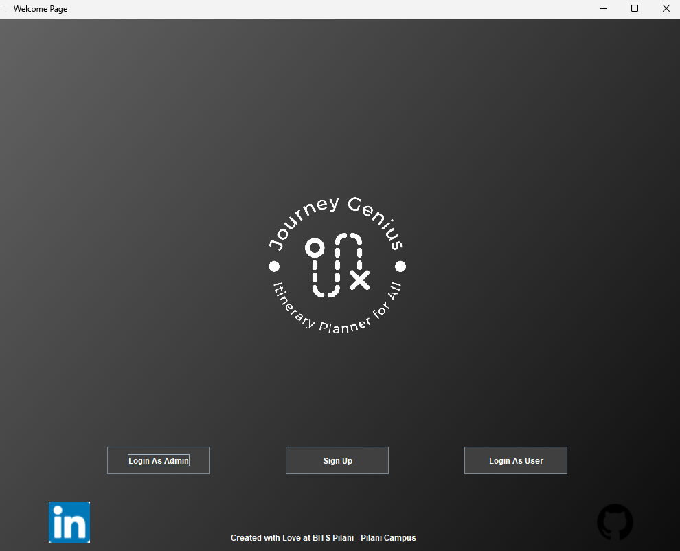
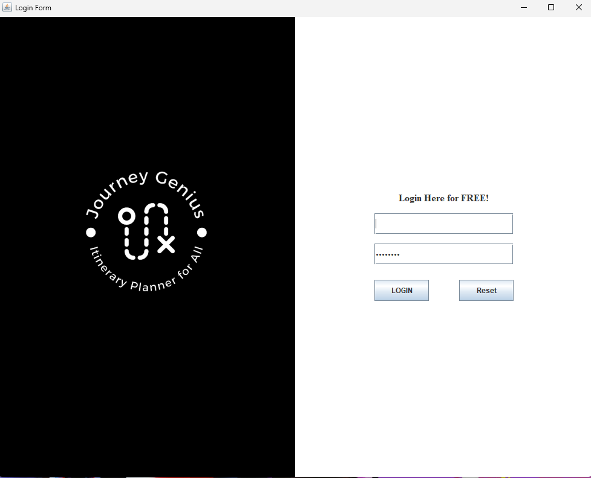
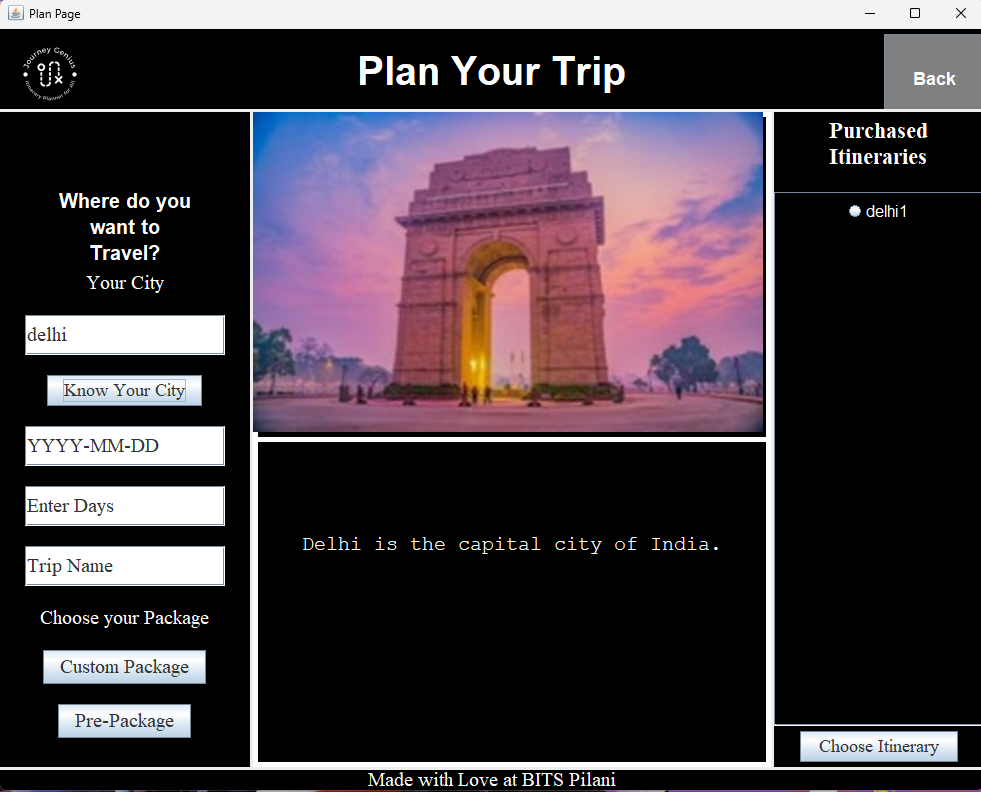
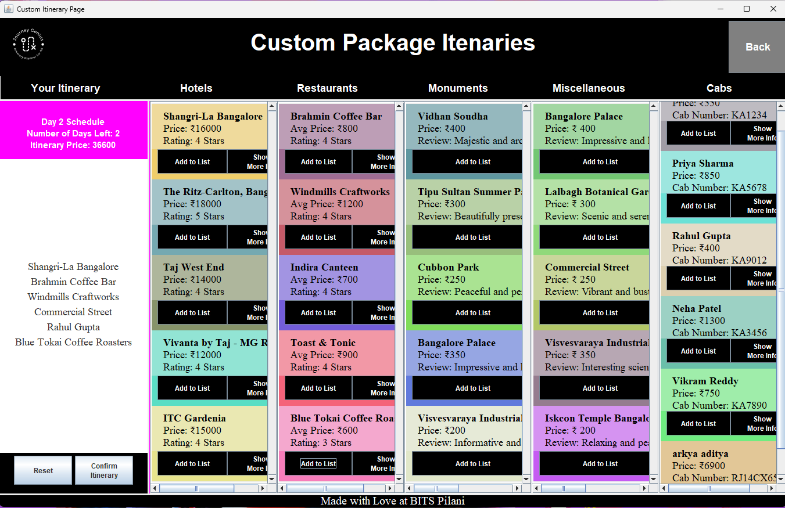
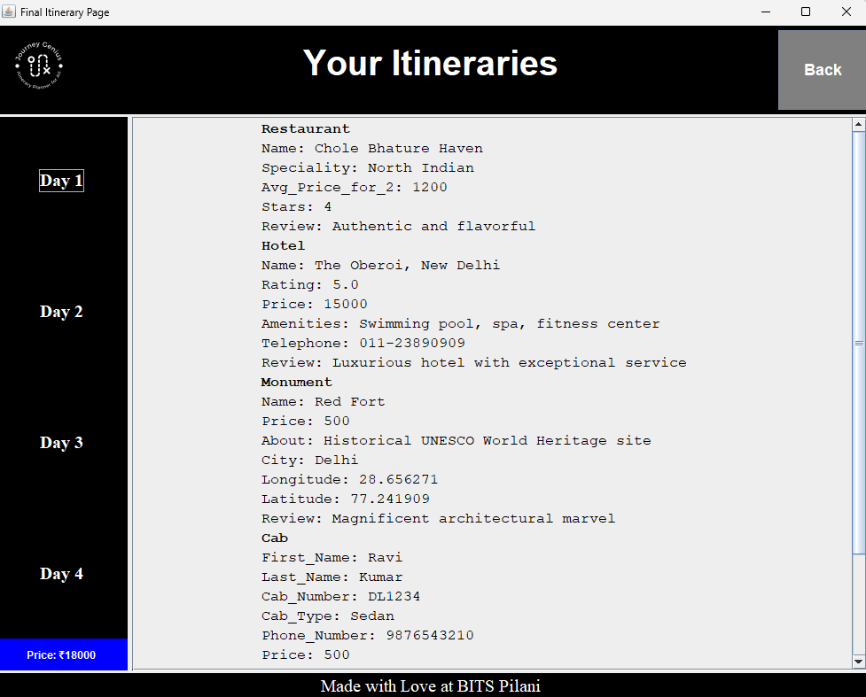

# Journey Genius Itinerary Planner App

Welcome to the Journey Genius Itinerary Planner App! This application is designed to help you seamlessly plan your travel itineraries, whether you're embarking on a solo adventure, organizing a family vacation, or coordinating a group trip. With Journey Genius, you can create detailed travel plans, choose from curated itineraries, and store your travel information efficiently.

## Overview

Journey Genius is a basic version of an itinerary planner app built using Java Swing for the user interface, Java for backend logic, and MySQL for database management. The app provides a user-friendly platform to design, manage, and store travel itineraries.

## Features

### 1. Create Custom Itineraries
- **Specify Destinations**: Add multiple destinations to your itinerary.
- **Set Dates**: Choose start and end dates for your trip.
- **Plan Activities**: Include various activities for each destination, such as sightseeing, dining, or leisure activities.
- **Manage Travel Details**: Keep track of transportation, accommodation, and other logistical details.

### 2. Pre-Packaged Itineraries
- **Popular Destinations**: Access a selection of prepackaged itineraries tailored to popular travel destinations around the world.
- **Customizable**: Use prepackaged itineraries as a base and customize them to fit your personal preferences and needs.

### 3. MySQL Database Integration
- **Efficient Storage**: Store itinerary data in a MySQL database for reliable and efficient data management.
- **Data Retrieval**: Retrieve saved itineraries quickly and easily.
- **User Accounts**: Create and manage user accounts to save and access multiple itineraries.

## Installation

### Prerequisites
- Java Development Kit (JDK) installed on your machine.
- MySQL Database installed and running.
- A Java Integrated Development Environment (IDE) like IntelliJ IDEA or Eclipse.

### Steps
1. **Clone the Repository**:
   ```bash
   git clone https://github.com/yourusername/journey-genius.git

2. **Set Up the MySQL Database**:
Create a new MySQL database.
- Import the provided SQL script (schema.sql) to set up the necessary tables.
- Update the database connection details in the application code (DBConnection.java).
- Build and Run the Application:

3. **Open the project in your IDE**.
- Build the project to resolve any dependencies.
- Run the Main.java file to start the application.
- 
## Usage
### Creating an Itinerary:
- Launch the app and log in or create a new user account.
- Navigate to the "Create Itinerary" section.
- Input your destinations, dates, and activities.
- Save your itinerary to the database.
- 
### Using Pre-Packaged Itineraries:

- Go to the "Pre-Packaged Itineraries" section.
- Browse through the available itineraries.
- Select an itinerary and customize it as needed.
- Save the customized itinerary to your account.
- 
### Managing Your Itineraries:
- Access the "My Itineraries" section to view and edit saved itineraries.
- Update details or delete itineraries as needed.
- 
- 